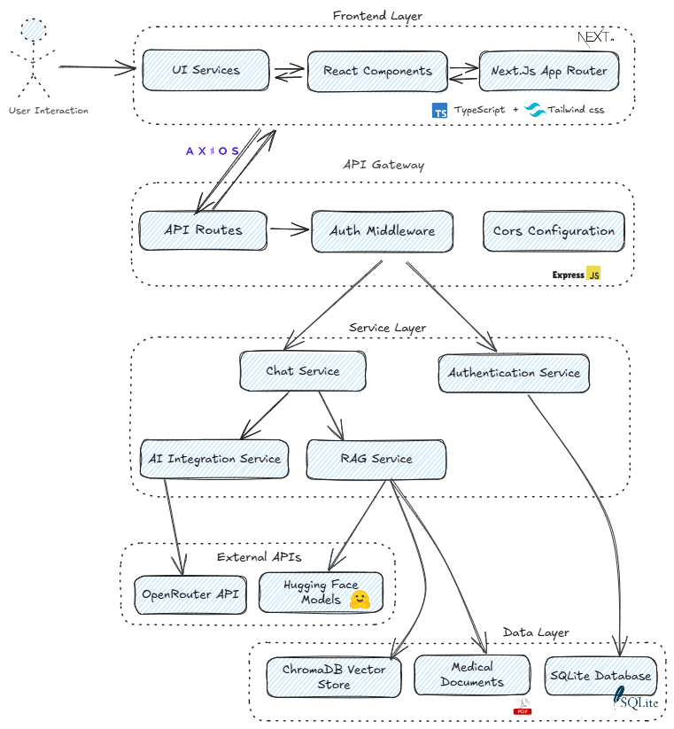

# Diabot - Your Intelligent Diabetes Companion 🩺🤖

Diabot is an advanced full-stack AI chat application designed to provide information and support related to diabetes. It leverages multiple Large Language Models (LLMs) and a Retrieval-Augmented Generation (RAG) system to offer contextual and accurate responses based on a specialized knowledge base.


## Key Features ✨

*   **User Authentication**: Secure registration and login system for personalized experiences.
*   **Multiple AI Models**: Access to a diverse range of cutting-edge LLMs via OpenRouter, including:
    *   Gemini 2.5 Flash
    *   GPT-4.1 Mini
    *   GPT-4o Mini
    *   DeepSeek Chat v3
    *   Mistral Nemo
    *   Gemma 3 4B
    *   Llama 3.1 8B
    *   Llama 4 Scout
    *   And other models like Mistral 7B Instruct, Claude Instant, GPT-3.5 Turbo.
*   **Retrieval-Augmented Generation (RAG) System**:
    *   Enhances LLM responses by incorporating information from a curated knowledge base of medical documents (PDFs).
    *   Utilizes ChromaDB for efficient vector storage and retrieval.
    *   
*   **Knowledge Base Management**:
    *   Intuitive interface to upload and manage PDF documents, which are processed and added to the RAG system.
    *   
    *   
*   **Interactive Chat Interface**:
    *   Real-time messaging with typing indicators and persistent chat history.
    *   User-friendly design featuring the Diabot logo consistently across the application.
    *   
*   **Model Benchmarking**:
    *   Integrated tools to evaluate and compare the performance of different LLMs on diabetes-related queries.
    *   Supports Multiple-Choice Question (MCQ) and Free-Form question benchmarks.
    *   
    *   
*   **Model Finetuning**:
    *   Provides resources for finetuning your own models. Notebooks and initial datasets are available in the `finetuning/` directory, specifically within `finetuning/notebook/`.
    *   Example finetuning results:
        *   Mean Token Accuracy: 
        *   Training Loss: 

## How it Works (Architecture Overview) ⚙️

Diabot employs a modular architecture consisting of a frontend, backend, a vector database for RAG, and various supporting services.

*   **Frontend**: Built with Next.js and React, providing a responsive and interactive user interface.
*   **Backend**: A Node.js/Express server that handles business logic, API requests, user authentication, LLM interactions via OpenRouter, and coordinates with the RAG system.
*   **RAG System**: Python scripts process uploaded PDF documents, generate embeddings, and store them in ChromaDB. When a user query is received, relevant information is retrieved from ChromaDB and provided as context to the LLM.
*   **Database**: SQLite is used for storing user data, chat history, and application settings.
*   **ChromaDB**: Acts as the vector store for the RAG system, enabling semantic search over the knowledge base.



*(Optional: Include `images/pipeline schema.png` if it provides additional clarity)*

## Tech Stack 🛠️

*   **Backend**: Node.js, Express.js, SQLite (`better-sqlite3`), JWT, OpenRouter API, ChromaDB Client, `python-shell` (for invoking PDF processing scripts).
*   **Frontend**: Next.js 15, React 19, TypeScript, Tailwind CSS, Radix UI, Axios.
*   **RAG & PDF Processing**: Python, Langchain, ChromaDB, PyMuPDF (or other PDF libraries).
*   **Database**: SQLite, ChromaDB (Vector Store).
*   **DevOps**: Docker (for ChromaDB).

## Project Structure 📁

```
Diabot-PFA-Project/
├── backend/                # Node.js backend application
│   ├── data/               # SQLite database, RAG summaries, uploaded files
│   ├── middleware/
│   ├── routes/
│   ├── services/
│   ├── utils/
│   ├── db.js
│   └── server.js
├── frontend/               # Next.js frontend application
│   ├── app/
│   ├── components/
│   ├── context/
│   ├── lib/
│   └── public/             # Static assets including Diabot-Logo.png
├── Benchmarking/           # Scripts and data for model benchmarking
│   ├── data_processing_scripts/ # (Assumed location for generate_wrong_answers.py, etc.)
│   ├── first_method_scripts/    # (Assumed location for benchmark_models.py)
│   └── second_method_scripts/   # (Assumed location for benchmark_free_answers.py, etc.)
├── chroma_db/              # ChromaDB data (mounted Docker volume)
├── data/                   # General data, potentially including initial RAG sources or datasets
├── finetuning/             # Scripts and data for model finetuning
│   ├── initial-data/       # Initial datasets for finetuning
│   └── notebook/           # Jupyter notebooks for finetuning process
├── images/                 # Project diagrams and screenshots for README
│   └── UI-screenshots/
├── models/                 # Potentially for storing downloaded/custom model files
├── scripts/                # Utility shell/batch scripts (e.g., start-dev.bat)
├── .gitignore
├── docker-compose.yml      # Docker configuration for ChromaDB
├── process_textbook.py     # Main Python script for textbook processing (RAG)
├── python_scripts_description.txt # Detailed descriptions of all Python scripts
├── README.md
└── start-dev.bat           # Batch script for easy startup on Windows
```
*(Note: The locations of individual Python scripts within `Benchmarking/` and for RAG processing are inferred. Update if specific subdirectories are different. RAG scripts like `process_summaries.py` and `process_textbook_enhanced.py` might be in a dedicated `rag_scripts/` folder or alongside `process_textbook.py` in the root.)*

## Getting Started 🚀

Follow these instructions to set up and run Diabot on your local machine.

### Prerequisites

*   **Node.js**: v18.x or higher (check `backend/package.json` for specific engine requirements).
*   **npm** or **yarn**.
*   **Python**: 3.9 or higher (recommended). Ensure `pip` is available.
*   **Docker** and **Docker Compose**: For running the ChromaDB vector store.
*   **OpenRouter API Key**: Obtain from [OpenRouter.ai](https://openrouter.ai/).

### 1. Clone the Repository

```bash
git clone <your-repository-url>
cd Diabot-PFA-Project
```

### 2. Environment Configuration

You'll need to set up environment variables for both the backend and frontend.

*   **Backend**: Create a `.env` file in the `backend/` directory:
    ```env
    OPENROUTER_API_KEY=your_openrouter_api_key_here
    JWT_SECRET=your_strong_jwt_secret_here
    PORT= 8090
    CHROMA_DB_URL=http://localhost:8000
    ```

*   **Frontend**: Create a `.env.local` file in the `frontend/` directory:
    ```env
    NEXT_PUBLIC_API_URL=http://localhost:8090
    # Add any other necessary frontend environment variables
    ```

### 3. Install Dependencies

*   **Node.js Dependencies**:
    ```bash
    # Install backend dependencies
    cd backend
    npm install

    # Install frontend dependencies
    cd ../frontend
    npm install
    ```

*   **Python Dependencies**:
    Navigate to the directory containing Python scripts (e.g., `python_scripts/`) and install dependencies. It's highly recommended to use a virtual environment.
    ```bash
    cd ../python_scripts  # Or your actual Python scripts directory
    python -m venv venv
    source venv/bin/activate  # On Windows: venv\Scripts\activate
    pip install -r requirements.txt # Assuming a requirements.txt exists
    # If no requirements.txt, manually install:
    # pip install langchain chromadb pypdf sentence-transformers # etc.
    ```
    *(Note: Create a `requirements.txt` in your Python scripts directory for easier setup.)*

### 4. Running the Application

*   **Step 4.1: Start ChromaDB (for RAG features)**
    In the project root directory (`Diabot-PFA-Project/`), run:
    ```bash
    docker-compose up -d
    ```
    This will start the ChromaDB service, typically accessible at `http://localhost:8000`.

*   **Step 4.2: Start Backend and Frontend**

    *   **Option A: Manual Start (Recommended for Development)**
        Open two separate terminals:

        *   **Terminal 1 (Backend)**:
            ```bash
            cd backend
            npm start
            ```
            The backend API will be available at `http://localhost:8090`.

        *   **Terminal 2 (Frontend)**:
            ```bash
            cd frontend
            npm run dev
            ```
            The frontend application will be accessible at `http://localhost:3000` (Next.js default dev port if 8090 is taken by backend).

    *   **Option B: Using the Batch Script (Windows Development)**
        In the project root directory (`Diabot-PFA-Project/`), run:
        ```bash
        start-dev.bat
        ```
        This script will attempt to start both the backend (on `http://localhost:8090`) and the frontend (on `http://localhost:3000` as configured in the script).

### 5. Access the Application

*   **Frontend**: `http://localhost:3000`
*   **Backend API**: `http://localhost:8090`
*   **ChromaDB Admin/API (for inspection)**: `http://localhost:8000`

## Usage Guide 📖

1.  **Register/Login**: Create a new account or log in with your existing credentials.
2.  **Select Model & Topic**: On the chat page, choose your preferred AI model and a medical topic to tailor the conversation.
3.  **Start Chatting**: Enter your medical questions or concerns in the chat input.
4.  **Manage Knowledge Base (RAG)**:
    *   Navigate to the "Knowledge".
    *   Upload PDF documents related to diabetes or other medical fields.
    *   The system will process these documents and add them to the RAG knowledge base.
    *   Future chats will leverage this information for more accurate and context-aware responses.
5.  **View Chat History**: Access your previous conversations from the sidebar.

## API Endpoints ↔️

(Refer to `backend/routes/` for detailed definitions)

### Authentication
*   `POST /api/auth/register`
*   `POST /api/auth/login`

### Models & Topics
*   `GET /api/models`
*   `GET /api/topics`

### Chat
*   `POST /api/chat/new_session`
*   `POST /api/chat/:sessionId/message`
*   `GET /api/chat/sessions`
*   `GET /api/chat/:sessionId/messages`

### RAG / Knowledge Base
*   `POST /api/rag/upload` - Upload a PDF document.
*   `POST /api/rag/process/:filename` - Process an uploaded PDF.
*   `GET /api/rag/documents` - List processed documents.
*   `DELETE /api/rag/documents/:filename` - Delete a processed document.
*   `POST /api/rag/reinitialize` - Reinitialize the RAG system (e.g., after multiple changes).

## Development Notes 📝

*   **Backend**: Uses `nodemon` for development, enabling automatic server restarts on file changes.
*   **Frontend**: Next.js provides hot-reloading for a smooth development experience.
*   **Python Integration**: The backend uses `python-shell` to execute Python scripts for PDF processing and RAG operations. Ensure your Python environment is correctly configured and accessible by the Node.js application.
*   **Styling**: Tailwind CSS is used for utility-first styling. Radix UI provides accessible unstyled components.

## Troubleshooting 🔍

*   **Port Conflicts**: Ensure ports `8090` (backend), `3000` (frontend), and `8000` (ChromaDB) are not in use by other applications.
*   **Environment Variables**: Double-check that `.env` (backend) and `.env.local` (frontend) files are correctly configured with necessary API keys and URLs.
*   **ChromaDB Issues**:
    *   Ensure Docker is running.
    *   Check `docker-compose logs -f chroma` for any errors if ChromaDB fails to start.
    *   Verify the backend can connect to `http://localhost:8000`.
*   **Python Script Errors**:
    *   Confirm Python and required libraries are installed in the correct environment.
    *   Check logs from the backend (Node.js console) for any errors reported by `python-shell`.
*   **Database Errors (SQLite)**: Ensure the `backend/data/` directory is writable by the Node.js process.

## Future Enhancements 💡

*   [x] RAG system implementation with ChromaDB *(Completed)*
*   [x] File upload for medical documents *(Completed)*
*   [ ] Real-time streaming responses for chat
*   [ ] Advanced model benchmarking analytics and visualization
*   [ ] User preferences and settings customization
*   [ ] Export chat conversations
*   [ ] Mobile application development (e.g., React Native)
*   [ ] More sophisticated RAG chunking and embedding strategies
*   [ ] Admin panel for user and content management

## Contributing 🤝

Contributions are welcome! Please follow these steps:
1.  Fork the repository.
2.  Create a new feature branch (`git checkout -b feature/your-feature-name`).
3.  Make your changes and commit them (`git commit -m 'Add some feature'`).
4.  Push to the branch (`git push origin feature/your-feature-name`).
5.  Open a Pull Request.
